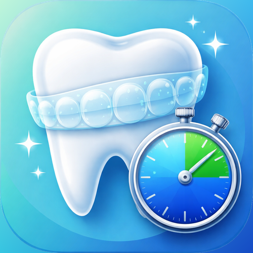
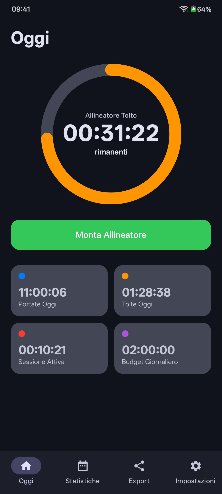
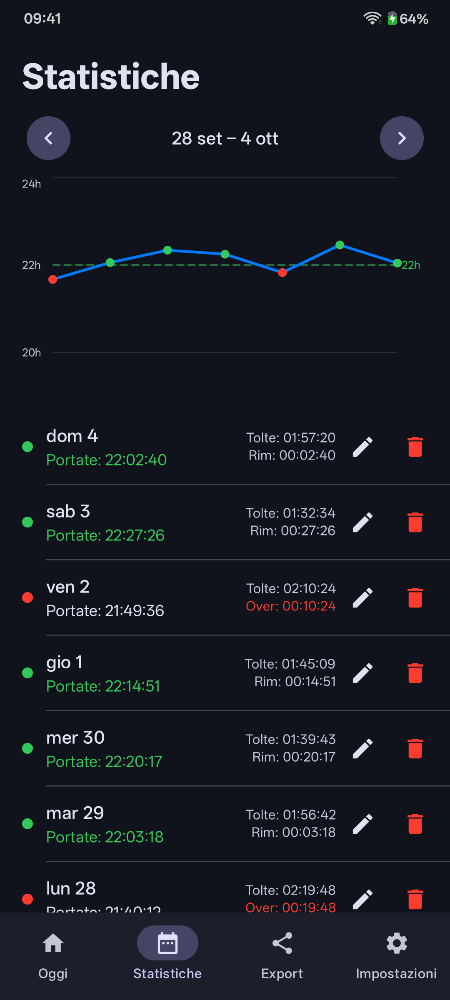
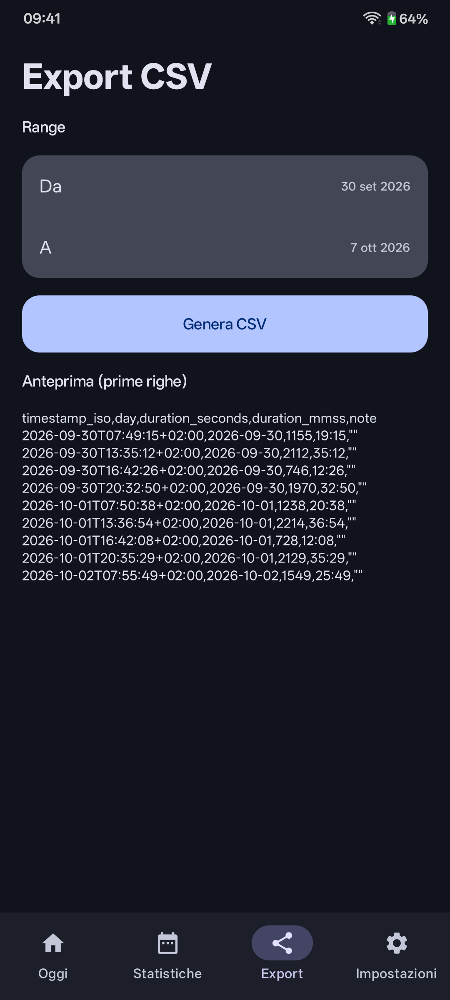
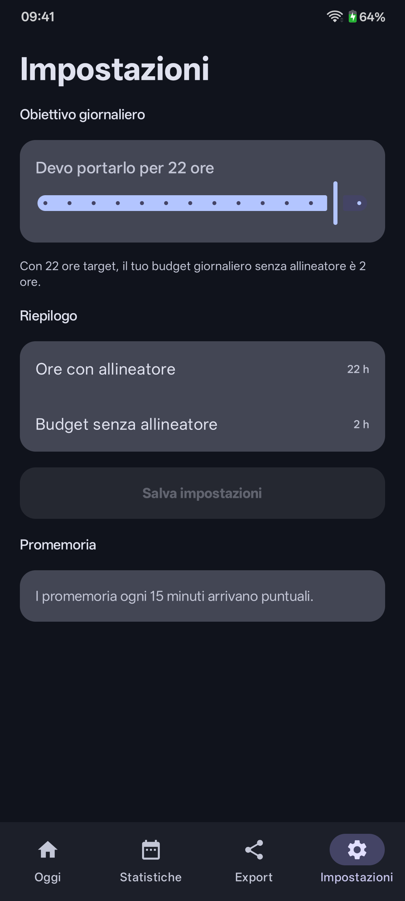

<p align="center">
  
</p>

<h1 align="center">Allineami for Android</h1>

<p align="center">
  A timer for people wearing clear dental aligners.<br>
  iOS version: <a href="https://github.com/mcrescentini/Allineami_iOS">Allineami_iOS</a>
</p>

---

Orthodontists usually ask you to wear clear aligners **22 hours a day**, which leaves **2 hours** for eating, brushing your teeth and cleaning the aligners. Allineami keeps track of that time: tap a button when you take them out, tap it again when you put them back in, and always see how much time you have left.

The app's interface is in Italian.

## Screenshots

_Screenshots taken with sample data._

| Today | Statistics | Export | Settings |
|:---:|:---:|:---:|:---:|
|  |  |  |  |

## Features

- **One-tap timer**: "Togli Allineatore" (take out) starts the count, "Monta Allineatore" (put back) stops it
- **Budget ring**: green, orange or red depending on how much time you have left, with an *OVER* label when you go past it
- **Daily summary**: hours worn, hours out, current session and daily budget
- **Weekly statistics**: a chart of hours worn against your goal, plus a list of days you can edit or delete
- **CSV export** of your sessions over a date range, to share with your orthodontist
- **Custom goal** from 10 to 23 hours a day
- **Chronometer notification** that stays visible while the aligners are out
- **Reminders** every 15 minutes, on time if you grant the "Alarms & reminders" permission
- **Automatic day change**: if the timer is still running after midnight, the time is split across the right days
- Layout that also works on **tablets**

## Privacy

Allineami **collects no data**: no account, no internet connection, no ads or tracking. Everything stays on your device. Read the [privacy policy](PRIVACY.md) (English and Italian).

## Project structure

```
.
├── app/src/main/java/com/allineami/app/
│   ├── data/          Storage, dates, CSV, timer logic
│   ├── notify/        Chronometer notification, reminders, reboot handling
│   └── ui/            Jetpack Compose screens
├── store/             Play Store icon and feature graphics
├── fastlane/          Google Play listing texts and images
├── docs/screenshots/
└── PRIVACY.md
```

## Building

Requirements: **JDK 17+** and Android SDK 36 (or Android Studio). The app runs on **Android 8.0** and later.

```bash
./gradlew installDebug   # install on a connected device
```

Or open the folder in Android Studio and press **Run**.

### Release build for Google Play

1. Create an upload key:
   ```bash
   keytool -genkeypair -v -keystore upload-keystore.jks -keyalg RSA -keysize 2048 -validity 10000 -alias upload
   ```
2. Copy `keystore.properties.example` to `keystore.properties` and fill in your values. Both files are excluded from git: **never publish them**.
3. Build the bundle:
   ```bash
   ./gradlew bundleRelease
   ```
   The file to upload to Play Console is `app/build/outputs/bundle/release/app-release.aab`.

## Tech stack

- **Kotlin** and **Jetpack Compose** (Material 3)
- **SharedPreferences** (JSON) to store sessions on the device
- **Compose Canvas** for the weekly chart
- **AlarmManager** and notifications for the timer and reminders

## License

Allineami is free software, released under the **GNU GPL v3** ([LICENSE](LICENSE)) with the **additional terms** allowed by Section 7, described in [NOTICE](NOTICE). In short:

- you may use, study and modify the code;
- if you distribute a modified version, you must publish its **source code under the same license**;
- you must keep the credit **"Based on Allineami by RootLabs — https://rootlabs.it/ — crescentinistudio.it"** and show it in the app's settings;
- published versions must use a **different name and icon** from "Allineami".

## Credits

Made by **[RootLabs](https://rootlabs.it/)** · [crescentinistudio.it](https://crescentinistudio.it/)

## Disclaimer

Allineami is a reminder tool and **is not a medical device**. Always follow your orthodontist's instructions for your treatment.
